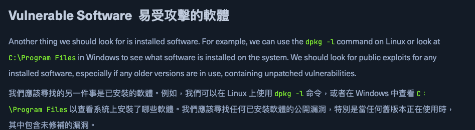

# Privilege Escalation  許可權提升
我們通常對遠端伺服器的初始訪問是在低許可權的使用者的情況下進行的，要獲得完全的許可權，我們需要透過漏洞將我們的許可權(privileges) 升級到 Linux 中的root, Windows 中的administrator/SYSTEM 

我們獲得了box 的初始訪問許可權後，我們希望透過徹底枚舉(enumerate)該box 以查找我們可利用的任何潛在漏洞，以實現更高級別的許可權。推薦的網站為 [HackTricks](https://book.hacktricks.wiki/en/index.html)、[PayloadsAllTheThings](https://github.com/swisskyrepo/PayloadsAllTheThings) 等等

## Enumeration Scripts  枚舉腳本
常見的 Linux 枚舉腳本包括 [LinEnum](https://github.com/rebootuser/LinEnum) 和 [linuxprivchecker](https://github.com/sleventyeleven/linuxprivchecker)，對於 Windows，包括 [Seatbelt](https://github.com/GhostPack/Seatbelt) 和 [JAWS](https://github.com/411Hall/JAWS)。

能用於 伺服器枚舉的另一個工具為  [Privilege Escalation Awesome Scripts SUITE （PEASS）](https://github.com/peass-ng/PEASS-ng)

>[!Note]
腳本將運行許多已知到用於是別漏洞的命令，這可能會觸發一些防毒軟體或安全監控軟體，進而阻止腳本運行，甚至於觸發系統已受損的緊報。所以在某些情況下我們會希望進行手動枚舉而不是運行腳本。

以 PEASS 運行Linux 腳本LinPEAS 為例子:
```
Coconut820@htb[/htb]$ ./linpeas.sh
...SNIP...

Linux Privesc Checklist: https://book.hacktricks.xyz/linux-unix/linux-privilege-escalation-checklist
 LEYEND:
  RED/YELLOW: 99% a PE vector
  RED: You must take a look at it
  LightCyan: Users with console
  Blue: Users without console & mounted devs
  Green: Common things (users, groups, SUID/SGID, mounts, .sh scripts, cronjobs)
  LightMangenta: Your username


====================================( Basic information )=====================================
OS: Linux version 3.9.0-73-generic
User & Groups: uid=33(www-data) gid=33(www-data) groups=33(www-data)
...SNIP...
```

如果我們透過google search 或是 searchsploit 會發現該版本的linux 系統有什麼漏洞，透過這些漏洞我們將可以在伺服器上運行腳本進而獲得root 的許可權



## User Privileges  用戶許可權
假設我們被允許以 root（或另一個使用者）的身份運行特定的命令。在這種情況下，我們可能能夠將我們的許可權升級到 root/系統使用者或以其他使用者身份獲得訪問許可權。以下是利用某些用戶許可權的一些常見方法：

1. Sudo
2. SUID
3. Windows Token Privileges  (Windows 令牌許可權)

### sudo:
使用 sudo -l 命令檢查我們擁有哪些 sudo 許可權：
```
Coconut820@htb[/htb]$ sudo -l

[sudo] password for user1:
...SNIP...

User user1 may run the following commands on ExampleServer:
    (ALL : ALL) ALL
```

使用 su 命令和 sudo 切換到 root 使用者：
```
Coconut820@htb[/htb]$ sudo su -

[sudo] password for user1:
whoami
root
```

在某些情況下，我們可能被允許執行某些應用程式或所有應用程式，而無需提供密碼：
```
Coconut820@htb[/htb]$ sudo -l

    (user : user) NOPASSWD: /bin/echo
```

NOPASSWD 條目顯示 /bin/echo 命令可以在沒有密碼的情況下執行，
為此，我們可以使用 -u user 指定 user：
```
Coconut820@htb[/htb]$ sudo -u user /bin/echo Hello World!

    Hello World!
```

一旦我們找到可以使用 sudo 運行的特定應用程式，我們就可以尋找利用它的方法以獲得 shell 作為 root 使用者

[go awayBins](https://gtfobins.github.io/) 包含一個命令清單以及如何通過 sudo 利用它們。我們可以搜索我們擁有 sudo 許可權的應用程式，如果它存在，它可能會告訴我們應該執行的確切命令以使用我們擁有的 sudo 許可權獲得 root 訪問許可權。

[LOLBAS](https://lolbas-project.github.io/#) 還包含一個 Windows 應用程式清單，我們可以利用這些應用程式來執行某些功能，例如在特權使用者的上下文中下載檔或執行命令。

## Scheduled Tasks  計劃任務
通常有兩種方法可以利用計劃任務 （Windows） 或 cron 作業 （Linux） 來提升我們的許可權：
1. 添加新的計劃任務/cron 作業
2. 誘騙他們執行惡意軟體

最簡單的方法是檢查我們是否被允許添加新的計劃任務。在 Linux 中，維護計畫任務的一種常見形式是通過 Cron 作業 。如果我們對特定目錄有寫入許可權，我們可以利用這些目錄來添加新的 cron 作業。這些包括：
```
1. /etc/crontab
2. /etc/cron.d
3. /var/spool/cron/crontabs/root
```

如果我們可以寫入 cron 作業調用的目錄，我們可以編寫帶有反向 shell 命令的 bash 腳本，該命令在執行時應該會向我們發送一個反向 shell。

## Exposed Credentials  公開的憑證
接下來，我們可以查找可以讀取的檔，並查看它們是否包含任何公開的憑據。這在配置檔 、 日誌檔和用戶歷史記錄檔（bash_history Linux 中為 PSReadLine 和 Windows 中）中非常常見。我們一開始討論的 enumeration 腳本通常會在文件中尋找潛在的密碼並提供給我們，如下所示：

```
[+] Searching passwords in config PHP files
[+] Finding passwords inside logs (limit 70)
...SNIP...
/var/www/html/config.php: $conn = new mysqli(localhost, 'db_user', 'password123');
```
正如我們所看到的，資料庫密碼 'password123' 被暴露了，這將允許我們登錄到本地 mysql 資料庫並查找有趣的資訊。

我們還可能檢查密碼重用 ，因為系統使用者可能已將其密碼用於資料庫，這可能允許我們使用相同的密碼切換到該使用者，如下所示：
```
Coconut820@htb[/htb]$ su -

Password: password123
whoami

root
```
我們還可能使用用戶憑證以該使用者身份通過 ssh 連接到伺服器。

## SSH Keys  SSH 金鑰
如果我們對特定使用者的 .ssh 目錄有讀取許可權，我們可以讀取他們在 /home/user/.ssh/id_rsa 或 /root/.ssh/id_rsa 中找到的私有 ssh 密鑰，並使用它來登錄伺服器。如果我們能讀取 /root/.ssh/ 目錄，也能讀取 id_rsa 檔，我們可以把它拷貝到我們的機器上，用 -i 標誌登錄：
```
ssh -i 透過id_rsa 檔案進行login
```

```
Coconut820@htb[/htb]$ vim id_rsa
Coconut820@htb[/htb]$ chmod 600 id_rsa
Coconut820@htb[/htb]$ ssh root@10.10.10.10 -i id_rsa

root@10.10.10.10#
```

如果我們發現自己對 users/.ssh/ 目錄具有寫入許可權，我們可以將公鑰放在使用者的 ssh 目錄中。 /home/user/.ssh/authorized_keys 此技術通常用於在以該使用者身份獲得 shell 後獲得 ssh 訪問許可權。當前的 SSH 配置將不接受其他使用者寫入的金鑰，因此只有當我們已經獲得了對該使用者的控制權時，它才會起作用

我們必須首先使用ssh -keygen 和 -f 來創建一個新的密鑰來指令輸出檔:
```
Coconut820@htb[/htb]$ ssh-keygen -f key

Generating public/private rsa key pair.
Enter passphrase (empty for no passphrase): *******
Enter same passphrase again: *******

Your identification has been saved in key
Your public key has been saved in key.pub
The key fingerprint is:
SHA256:...SNIP... user@parrot
The key's randomart image is:
+---[RSA 3072]----+
|   ..o.++.+      |
...SNIP...
|     . ..oo+.    |
+----[SHA256]-----+
```

這將為我們提供兩個檔：key（我們將與 ssh -i 一起使用）和 key.pub，我們將將它們複製到遠端機器上。讓我們複製 key.pub，然後在遠端機器上，我們將它添加到 /root/.ssh/authorized_keys：
```bash
# bash
user@remotehost$ echo "ssh-rsa AAAAB...SNIP...M= user@parrot" >> /root/.ssh/authorized_keys
```

現在，遠端伺服器應該允許我們使用私有金鑰以該使用者身份登錄：
```
Coconut820@htb[/htb]$ ssh root@10.10.10.10 -i key

root@remotehost# 
```